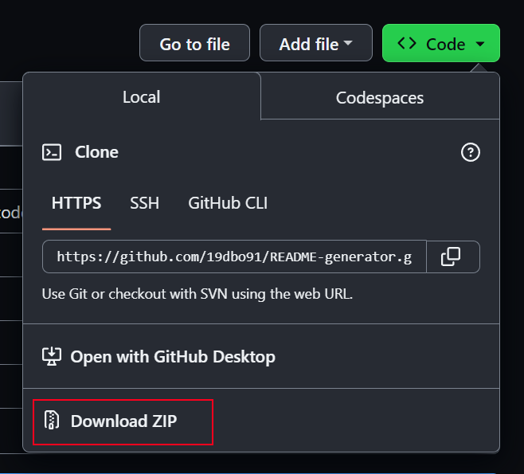
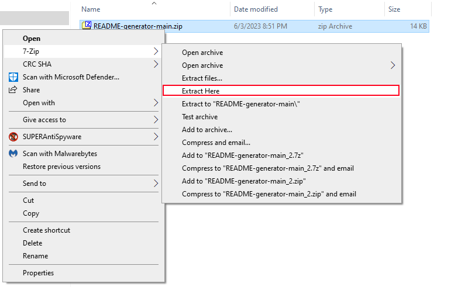
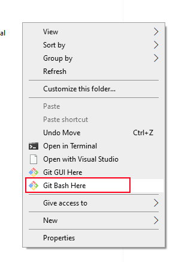

# README Generator


## Description

The objective of this project is to templatize the process of creating a high-quality README.md so that we can free up more time for solving problems and creating sites. As an amateur web developer, I created this generator so that I do not have to reinvent a README every time I wan to start a new project. Like most of you, I want to more of my time the more creative and rewarding part of developing. This program prompts you with a series of questions to respond with. This README.md was created using this tool.

## Table of Contents

- [README Generator](#readme-generator)
  - [Description](#description)
  - [Table of Contents](#table-of-contents)
  - [Installation](#installation)
    - [Prequisites](#prequisites)
  - [Usage](#usage)
  - [License](#license)
  - [Questions](#questions)

## Installation

### Prequisites
- GitBash (_or another shell_)
- Node.js (v16.18)

Navigate to _[https://github.com/19dbo91/README-generator](https://github.com/19dbo91/README-generator)_.
Click the button _**Code**_ and then under the dropdown select _**Download ZIP**_



Extract the _**README-generator-main.zip**_ file



Right-click to open the context menu on the window and then select _**Git Bash Here**_



In GitBash, install the dependency _**Inquirer (v8.2.4)**_
```
npm i inquirer@8.2.4
```

Once its installed, you can start the program.

## Usage

Run the command `node index.js` to begin.
```
node index.js
```

Answer the prompts that appear. You can answer them thoroughly or use defaults to speed things along. All the optional questions will be omitted if left blank.
```
$ node index.js
? What is the name of your project?
? How does your project works? Your motivation behind it? The problem its intended to solve?
? How do I install your program?
? How do I use your program?
? What license will your project be under? Refer to <https://choosealicense.com/>. Choose one:
? (Optional) How do I contribute to your repository?
? (Optional) How do I test your program?
? (Optional) How should others reach out to you for questions?
? (Optional) Please provide your Github username:
? (Optional) Please provide your email address:
```

After you answer the last question, you will see a preview of what's written on the README.
```
Document ./newREADME.md saved.
```
**Congratulations! You can now access your `newREADME.md`.**

Move this file to your new project folder and _**rename it to `README.md`**_. Rename _after_ you move it to avoid name conflict with this README. If you don't rename it, GitHub may not be able to identify it.

Afterwards, tailor your README and iterate changes on top of it.

## License

[No License](https://choosealicense.com/no-permission/)

## Questions

For questions regarding this CMD-Line app, please feel free to message me at
- Github: [19dbo91](https://github.com/19dbo91)
- Email: [bonilla.dustin@gmail.com](mailto:bonilla.dustin@gmail.com)
